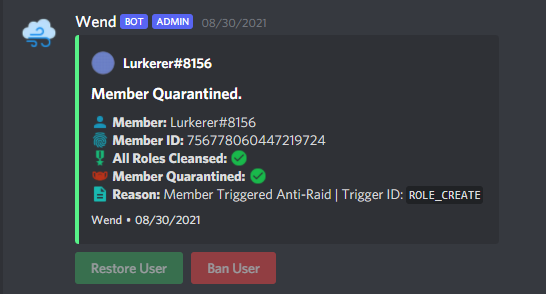
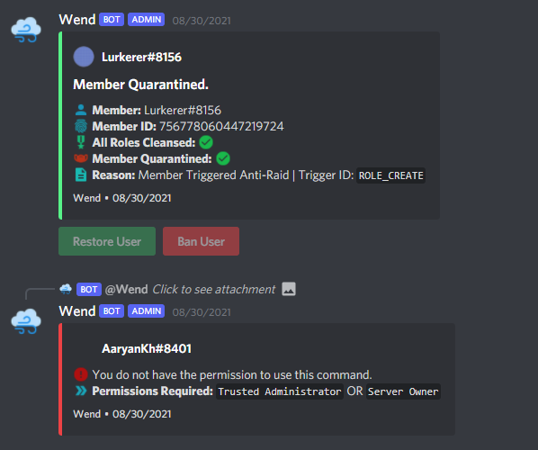
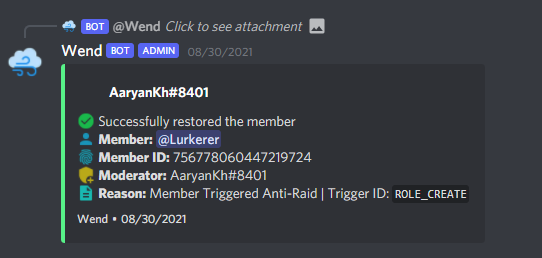

# AntiRaid

## What is anti-raid?

Due to wend's anti-raid system, server owners can protect their server from being attacked by raiders or untrusted staff by limiting the number of joins per minute, role creation and deletion, channel creation and deletion, mass pinging, etc. 

## What happens when someone triggers anti-raid?

If someone triggers anti-raid, then the member will lose all their roles \(this is important as if the member has **administrator** permissions, then the member can easily bypass the anti-raid\) and will receive a role named "Quarantined" which blocks the member from accessing any channel.

When the member gets quarantined, a special **log** is sent to the mod-logs channel of the server, which includes the member name, ID, and the reason why the member got quarantined. It will be similar as:

## How to un-quarantine the member?

There are **2** methods to un-quarantine a quarantined member. They are:

1. **By commands:** You can un-quarantine a quarantined member by using the **un-quarantine** command. You can use the command by typing `>unquarantine <member_id> <optional reason>` and sending it. Also, it is important to have the `Trusted Admin` or the `Server Owner` Static in order to un-quarantine the member. \(Check "Commands &gt; Anti-Raid &gt; Statics"\)
2. **By the log itself:** As shown in the image above, there are two buttons from which, by clicking can either **un-quarantined** or **ban** the member. By clicking the buttons, can do the function of what they are labeled. Again, you will require the `Trusted Admin` or the `Server Owner` Static in order to run those commands.

## More about Anti-Raid

There's an entire section for **anti-raid** in this guide, check that section for more information about anti-raid.

